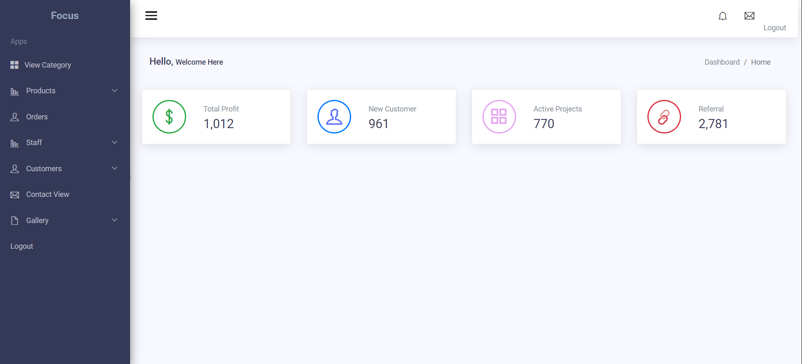
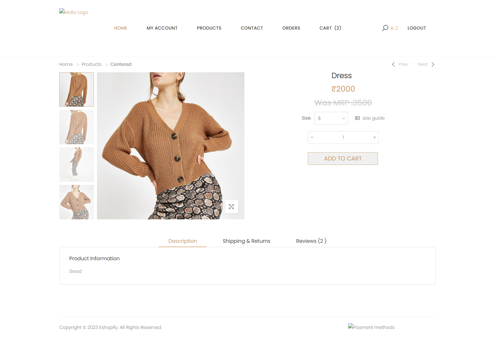
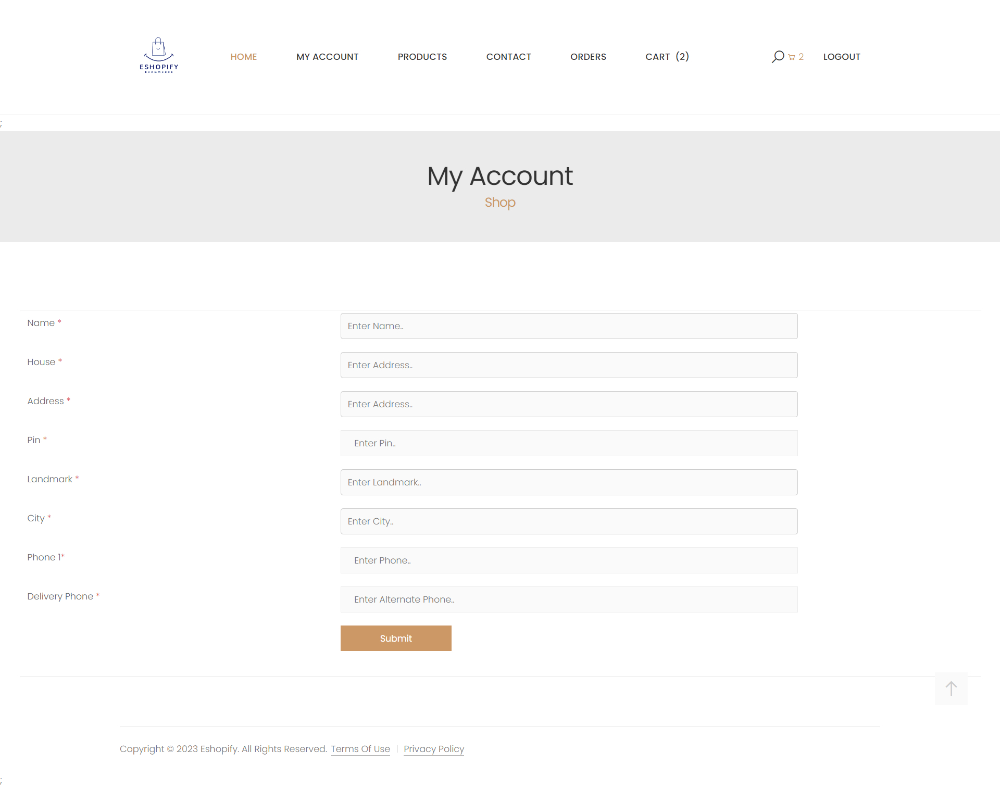
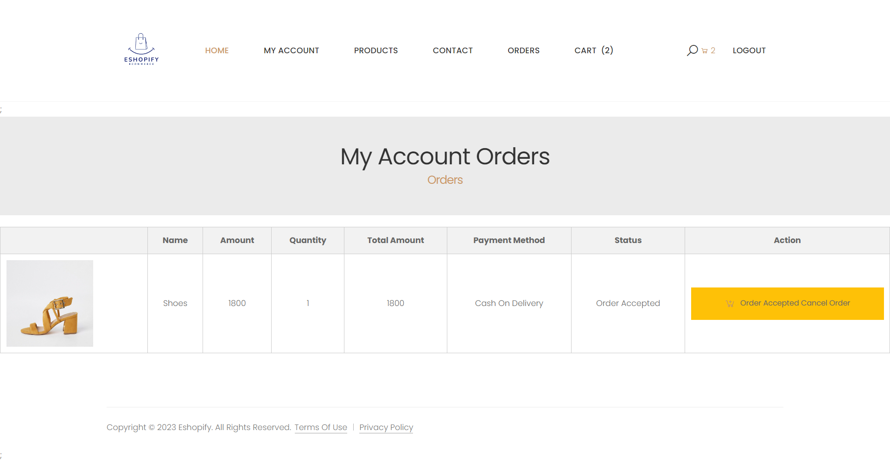

# Eshopify
 <h3>Abstract:</h3> 
Eshopify is an online e-commerce project built using the Laravel framework. The project aims to provide users with a seamless shopping experience by offering a wide range of products, including returnable items. Users can browse through various product categories, add items to their cart, and place orders. The project also allows users to provide reviews for the purchased products, enabling other users to make informed decisions.

Eshopify incorporates a cash-on-delivery system, ensuring convenient payment options for users. The project consists of three main modules: Admin, Staff, and User.

The Admin module empowers the site administrators with administrative functionalities. They can add and manage product categories, upload products with relevant details, and perform actions such as editing or deleting products. Additionally, administrators can add and manage staff members, review their profiles, and approve or reject them accordingly. The module also enables admins to view orders and generate QR codes associated with each order for verification by the delivery agent during the delivery process. The project includes a contact view page to manage user inquiries and feedback.

The Staff module is designed to facilitate the delivery process. Staff members can access their assigned deliveries, review details, and accept, reject, or request returns for each delivery. Notifications are sent to staff members upon scanning the QR codes on the products, allowing for seamless communication and tracking.

The User module is tailored for customers to explore products based on categories and perform search operations. Users can add products to their cart, view multiple product images, and proceed to place orders. The project supports a single ordering and "buy all" option, streamlining the purchasing process. Users can provide their delivery address and track their orders. Only the cash-on-delivery payment method is available for users.

Overall, Eshopify aims to provide a comprehensive e-commerce solution, integrating essential features such as product management, user reviews, cash-on-delivery payments, order tracking through QR codes, and a user-friendly interface for a seamless shopping experience.
 <h3>Home</h3>
 
# Modules
Admin Module:

<ol>
<li>Add product category</li>
<li>Add products based on category</li>
<li>View uploaded products with options to edit and delete</li>
<li>Add staff members</li>
<li>View staff members with options to edit, delete, approve, or reject</li>
<li>View orders with the option to generate QR codes for order verification during delivery</li>
<li>Contact view page to manage inquiries from users, non-users, and staff</li>
<li>View and manage users, with options to delete, approve, or reject</li>
</ol>

Staff Module:

<ol>
<li>View assigned deliveries</li>
<li>Accept, reject, or request returns for deliveries</li>
<li>Pass notifications by scanning QR codes on products for seamless communication</li>
</ol>

User Module:

<ol>
<li>View products based on categories</li>
<li>Search for specific products</li>
<li>Place orders</li>
<li>Cancel orders</li>
<li>Add delivery details</li>
<li>Cash-on-delivery payment system</li>
<li>Add products to the cart and view them</li>
<li>View multiple product images</li>
<li>Single ordering and "buy all" option</li>
<li>Purchase products by providing a proper delivery address</li>
<li>Order is confirmed by mail</li>
<li>Order delivery success message is confirmed by mail</li>
<li>User can like, dislike, and add product reviews</li>
</ol>
 
 # images
 

 <h3>Products Page</h3> 
 
 <h3>All Products Listing Page</h3> 
 
 <h3>Products Info</h3> 
 
 <h3>Accounts</h3> 
 
 <h3>User Order Page</h3> 
 
 <h3>Payment</h3> 
 
 <h3>QR Code Scanning</h3> 
 
 <h3>SignUp Page</h3> 
 
 <h3>SignIn Page</h3> 
 
